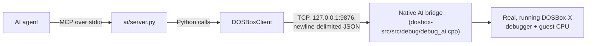

# AI Agent Usage Guide

*[English](AGENT_GUIDE.md) | [繁體中文](AGENT_GUIDE.zh-TW.md)*

This is the reference for an **AI agent** (or the person configuring one) that
wants to connect to DOSBox-X MCP Debugger and actually drive a live DOSBox-X
session: what to install, how to start everything, every tool the agent can
call, what each one returns, and the error codes it needs to handle.

For the project's story, status, and design rationale, see [`README.md`](README.md)
and [`docs/dosbox-ai-bridge.md`](docs/dosbox-ai-bridge.md). This guide only
covers *how to use it*.

## How it fits together



- The agent talks **MCP** (Model Context Protocol) to `ai/server.py` over
  stdio -- this is the process your MCP host spawns.
- `ai/server.py` is a thin wrapper: every tool call becomes one call into
  `DOSBoxClient` (`ai/dosbox_client.py`), which speaks a small
  newline-delimited JSON-RPC protocol over a plain TCP socket.
- That socket is the **native AI bridge**, compiled directly into
  `dosbox-x.exe` (`dosbox-src/src/debug/debug_ai.cpp`). It binds only to
  `127.0.0.1:9876` (loopback -- never reachable from outside the machine)
  and talks to the exact same debugger state and breakpoint mechanism the
  DOSBox-X debugger GUI itself uses. There is no second CPU emulator, no
  GUI automation, and no fabricated state anywhere in this path.

Everything the agent sees is real: real registers, real memory, real
breakpoints, real execution control, real keyboard/mouse input delivered
through DOSBox-X's own input-handling code.

## Required environment

| Requirement | Notes |
|---|---|
| Windows | The native bridge's socket code has a POSIX branch, but only the Windows build (Visual Studio) is built, tested, and documented by this project. |
| Visual Studio 2019 or later, C++ desktop workload | Needed once, to build `dosbox-x.exe` from the `dosbox-src` submodule. Not needed at runtime. |
| Python 3.10+ (tested with 3.12) | Runs `ai/server.py` and the rest of `ai/`. |
| An MCP-capable agent host | Anything that can spawn a stdio MCP server and call tools on it (Claude Code, Claude Desktop, or any other MCP client). |

Node/npm are **not** required to use the agent -- they only appear in this
project's very earliest scaffolding notes (`ai/TASK.md`) for an
MCP-Inspector-based manual check during initial setup, not for normal use.

## Installation

### 1. Clone with submodules

```
git clone --recurse-submodules https://github.com/pmanyeh/DOSBox-X-MCP-Debugger.git
```

See `README.md`'s "Getting started" section for the Windows long-path
caveat and the exact `dosbox-src` submodule commit if you need to verify
it.

### 2. Python environment

```
python -m venv .venv
.venv\Scripts\pip install -r requirements.txt
```

This installs the pinned `mcp==2.0.0` SDK and `pytest`.

### 3. Build the native bridge

Open `dosbox-src\vs\dosbox-x.sln` in Visual Studio and build the `Release`
(x64) configuration, or from the command line:

```
cd dosbox-src\vs
msbuild dosbox-x.vcxproj /p:Configuration=Release /p:Platform=x64 /m
```

(Match `/p:PlatformToolset=...` to whatever Visual Studio version you have
installed if the default doesn't resolve.) This project changes source
files only, not the build system -- `dosbox-src` builds the same way
upstream DOSBox-X does. Both `C_DEBUG` and `C_HEAVY_DEBUG` are already
enabled by default in this fork's `dosbox-src/vs/config.h`, so a normal
build already includes everything the AI bridge and its memory-watchpoint
tools need -- no special flags required.

The build produces `dosbox-src\bin\x64\Release\dosbox-x.exe`.

### 4. Launch DOSBox-X with the AI bridge active

From the repository root:

```
dosbox-src\bin\x64\Release\dosbox-x.exe -defaultdir -break-start drive_c\YOURPROGRAM.EXE
```

- `-break-start <program>` runs that program and stops the debugger at its
  entry point immediately -- the usual starting point for a debugging
  session. Omit it (or use `pause_execution()` once running) to attach to
  a program already running under a normal launch.
- `-defaultdir` skips a one-time "select working directory" folder-picker
  dialog that a *never-before-run* `dosbox-x.exe` path otherwise pops up
  before the AI bridge socket opens. Without it, that dialog blocks
  startup until someone clicks through it.
- Once running, the native AI bridge is listening on `127.0.0.1:9876`. No
  extra step is needed to "start" the bridge -- it comes up automatically
  with the debugger (`DEBUG_AI_Init()`, called from `DEBUG_Init()`).

### 5. Point your MCP host at `ai/server.py`

Example MCP server config (adjust paths to your clone location):

```json
{
  "mcpServers": {
    "dosbox-x-debugger": {
      "command": "C:\\path\\to\\DOSBox-X-AI\\.venv\\Scripts\\python.exe",
      "args": ["C:\\path\\to\\DOSBox-X-AI\\ai\\server.py"]
    }
  }
}
```

`ai/server.py` is the unbounded, general-purpose tool surface (26 tools,
listed below) and is the one intended for normal agent use. Two other MCP
entry points exist for specific, narrower purposes and are **not** what
most agents should connect to:

- `ai/server_phase5a.py` -- a restricted read/execution-control-only
  subset used by this project's own tool-awareness test scenarios.
- `ai/server_phase5c.py` -- the same 12-tool subset wrapped in a bounded,
  budgeted, evidence-logging research harness (`--total-budget`,
  `--exec-budget`, `--deadline-seconds`, `--allowed-tools`,
  `--evidence-log`), used for this project's own controlled acceptance
  testing. It does not expose the Phase 6A/6B tools at all.

### 6. Verify

Call the `ping` tool -- it should return `"DOSBox-X AI Debugger is alive."`
without needing DOSBox-X to be running at all (it doesn't touch the
bridge). Then, with DOSBox-X running per step 4, call `get_debug_status`
and confirm you get back a real `stopped`/`location`/`registers` snapshot
rather than a `DOSBOX_NOT_CONNECTED` error.

## Available tools

26 tools, grouped by what they do. "Precondition" is the debugger state a
call requires; calling it in the wrong state returns a specific error
(see [Error codes](#error-codes)) rather than blocking or silently doing
nothing.

### Session / meta

| Tool | Parameters | Returns | Precondition |
|---|---|---|---|
| `ping` | none | `"DOSBox-X AI Debugger is alive."` | none (doesn't touch DOSBox-X) |
| `get_project_status` | none | `{"project", "phase", "dosbox_bridge", "debugger", "mcp"}` | none |

### Debugger state (read-only)

| Tool | Parameters | Returns | Precondition |
|---|---|---|---|
| `get_debug_status` | none | `{"stopped", "running", "location": {"cs","eip"}, "instruction": {"bytes","text"}, "registers", "segments", "flags"}` when stopped; `{"stopped": false, "running": true}` when running | none |
| `get_cpu_state` | none | Register/segment snapshot | none -- **does not** by itself prove execution is stopped; use `get_debug_status` if you need that |
| `get_current_instruction` | none | The instruction at the current CS:EIP | debugger stopped |

### Memory & disassembly

| Tool | Parameters | Returns | Precondition |
|---|---|---|---|
| `read_memory` | `address: "SEG:OFF"`, `length: int` | `{"bytes": [...]}` | debugger stopped |
| `disassemble` | `address: "SEG:OFF"`, `count: int` | list of disassembled instructions | debugger stopped |
| `write_memory` | `address: "SEG:OFF"`, `data: [int 0-255 or 2-digit hex string, ...]` | write confirmation | debugger stopped |

### Registers

| Tool | Parameters | Returns | Precondition |
|---|---|---|---|
| `write_register` | `register: str`, `value: hex string` | write confirmation | debugger stopped; `register` must be one of `eax/ebx/ecx/edx/esi/edi/ebp` -- EIP, segment registers, ESP, and EFLAGS are rejected (`REGISTER_NOT_WRITABLE`) to avoid desyncing execution |

### Breakpoints

| Tool | Parameters | Returns | Precondition |
|---|---|---|---|
| `set_breakpoint` | `address: "SEG:OFF"` | breakpoint id | debugger stopped; fails `BREAKPOINT_ALREADY_EXISTS` if one is already there |
| `set_real_memory_breakpoint` | `address: "SEG:OFF"` | breakpoint id, `"type": "memory"` | debugger stopped when set; fires later (on continue/step) when that byte's value changes |
| `set_protected_memory_breakpoint` | `address: "SELECTOR:OFFSET"` | breakpoint id, `"type": "protected_memory"` | same as above, protected mode |
| `delete_breakpoint` | `breakpoint_id: int` | deletion confirmation | id must currently exist (`BREAKPOINT_NOT_FOUND` otherwise); ids are *positions* in DOSBox-X's own breakpoint list and shift when breakpoints are added/removed -- call `list_breakpoints` again if unsure |
| `list_breakpoints` | none | list of `{"id", "address", "type", "enabled"}`, `type` is `"code"`, `"memory"`, or `"protected_memory"` | none |

The two memory-watchpoint tools use DOSBox-X's own byte-change watchpoint
mechanism (BPPM) and are only available on heavy-debug builds
(`INTERNAL_ERROR` otherwise) -- this fork's default build config already
enables that, see [Installation](#installation).

### Execution control

| Tool | Parameters | Returns | Precondition |
|---|---|---|---|
| `continue_execution` | none | `{"stopped": false, "running": true}` | debugger stopped; fails `ALREADY_RUNNING` otherwise |
| `pause_execution` | none | real `debug.status` snapshot taken after the CPU genuinely stopped | guest running; fails `ALREADY_STOPPED` otherwise; fails `EXECUTION_TIMEOUT` if it didn't complete in time |
| `step_into` | none | debug status snapshot after exactly one instruction | debugger stopped; fails `ALREADY_RUNNING` otherwise |
| `step_over` | none | debug status snapshot after the instruction (a CALL/INT/LOOP/REP runs to completion first) | debugger stopped; fails `ALREADY_RUNNING`; fails `EXECUTION_TIMEOUT` if the stepped-over call doesn't return in time (check `get_debug_status` afterward -- it may have completed since) |

### Keyboard input

| Tool | Parameters | Returns | Precondition |
|---|---|---|---|
| `key_down` | `key: str` | `{"pressed": true}` | **guest execution running** (not stopped); fails `DEBUGGER_STOPPED` otherwise |
| `key_up` | `key: str` | `{"pressed": false}` | same |
| `key_tap` | `key: str` | `{"tapped": true}` | same -- the common case, e.g. `key_tap("enter")` to advance dialogue |

All three go through the exact same internal path DOSBox-X's own SDL
keyboard handler uses (`KEYBOARD_AddKey()`) -- never OS-level key
injection, window focus tricks, or GUI automation.

`key` must be one of this fixed whitelist (unrecognized names fail
`INVALID_PARAMETER` rather than being guessed at):

```
Digits:      1 2 3 4 5 6 7 8 9 0
Letters:     q w e r t y u i o p a s d f g h j k l z x c v b n m
Function:    f1 f2 f3 f4 f5 f6 f7 f8 f9 f10 f11 f12
Control:     esc tab backspace enter space
Modifiers:   leftalt rightalt leftctrl rightctrl leftshift rightshift
             capslock scrolllock numlock
Punctuation: grave minus equals backslash leftbracket rightbracket
             semicolon quote period comma slash
Navigation:  printscreen pause insert home pageup delete end pagedown
Arrows:      left up down right
Numpad:      kp1 kp2 kp3 kp4 kp5 kp6 kp7 kp8 kp9 kp0
             kpdivide kpmultiply kpminus kpplus kpenter kpperiod
```

This is the standard US 104-key layout. Windows keys, F13-F24, and
Japanese/Korean-specific keys are not mapped yet. Free-text input
(`type_text`) does not exist yet either -- see
[`docs/phase6b-input-injection-design.md`](docs/phase6b-input-injection-design.md)
for why.

**Held keys are tracked per MCP session and auto-released if the
connection drops** (agent crash, session timeout) before `key_up` is
called -- a key can never get permanently stuck down in the guest because
the agent went away. Call `release_all_input` to do this proactively.

### Mouse input

| Tool | Parameters | Returns | Precondition |
|---|---|---|---|
| `move_mouse_relative` | `dx: number`, `dy: number` | `{"moved": true}` | guest execution running; fails `DEBUGGER_STOPPED` otherwise |
| `set_mouse_button` | `button: 0\|1\|2`, `pressed: bool` | `{"pressed": bool}` | same |
| `click_mouse` | `button: 0\|1\|2` | `{"clicked": true}` | same |
| `release_all_input` | none | `{"released": true}` | releases every key/button this session currently holds -- safe to call any time execution is running, even if nothing is held |

`button` is `0` (left), `1` (right), `2` (middle). All routed through
`Mouse_CursorMoved()`/`Mouse_ButtonPressed()`/`Mouse_ButtonReleased()` --
the same functions DOSBox-X's own SDL mouse handler calls.

**Known limitation**: `move_mouse_relative` only reaches the guest while
DOSBox-X's mouse is captured (`Ctrl+F10`) and the guest is running a
driver that reads relative motion -- this call does not itself toggle
mouse capture. Button press/click do not have this dependency.

### Frame capture

| Tool | Parameters | Returns | Precondition |
|---|---|---|---|
| `capture_frame` | `format: "png"\|"rgba"` (default `"png"`), `max_width: int` (optional), `max_height: int` (optional) | `format="png"`: a directly viewable image plus a metadata block (`frame_id`, `width`, `height`, `captured_at_emulated_ms`); `format="rgba"`: `{"frame_id", "width", "height", "pixel_format": "rgba8888", "rgba_base64", ...}` | meaningful whether stopped or running, but see below |

Captures exactly the guest's own rendered frame -- never the DOSBox-X
window, the host desktop, or any other host window -- through the same
internal hook DOSBox-X's own screenshot/AVI recording already use.
Nothing is ever written to disk on the host. Use `"png"` (the default)
when you want to actually look at the picture; use `"rgba"` when you
need exact pixel values (e.g. cross-checking a known color at a known
coordinate) rather than a viewable image.

`max_width`/`max_height` downscale the result (nearest-neighbor, aspect
ratio preserved) if the native frame would exceed them; omit both for
native resolution. If the encoded frame still exceeds the bridge's
payload cap, the call fails with `FRAME_TOO_LARGE`, whose message
includes a suggested smaller `max_width`/`max_height` to retry with --
the frame is never silently truncated.

**A fully halted guest is not producing new rendered frames** (VGA frame
timing is driven by hardware events that only fire while the guest is
actually running) -- calling `capture_frame` while the debugger is
stopped will usually time out (`EXECUTION_TIMEOUT`) rather than return
instantly. Call `continue_execution()` first for a reliable capture.

## Error codes

Every failure comes back as a structured `{"code", "message"}` error
(never a raw exception or a silent no-op). Codes an agent should
specifically branch on:

| Code | Meaning | Typical response |
|---|---|---|
| `DEBUGGER_NOT_STOPPED` | A stopped-only tool was called while running and the debugger never got a chance to stop in time | Call `pause_execution` first, or check `get_debug_status` |
| `DEBUGGER_STOPPED` | A running-only tool (input injection) was called while stopped | Call `continue_execution` first |
| `ALREADY_RUNNING` | `continue_execution`/`step_into`/`step_over` called while already running | Check `get_debug_status` first |
| `ALREADY_STOPPED` | `pause_execution` called while already stopped | Check `get_debug_status` first |
| `EXECUTION_TIMEOUT` | `pause_execution`/`step_over` didn't complete in time | Call `get_debug_status` -- it may have completed shortly after |
| `MEMORY_ERROR` | Requested guest memory is unmapped/inaccessible | Don't retry with the same address |
| `REGISTER_NOT_WRITABLE` | Register isn't in the write whitelist | Don't retry |
| `BREAKPOINT_NOT_FOUND` | Breakpoint id doesn't currently exist | Call `list_breakpoints` for current ids |
| `BREAKPOINT_ALREADY_EXISTS` | A breakpoint is already at that address | Use the existing one, or `delete_breakpoint` first |
| `INVALID_PARAMETER` | Malformed/out-of-range/unrecognized parameter (e.g. unknown key name, bad mouse button) | Fix the parameter, don't retry as-is |
| `INVALID_ADDRESS` | Malformed `"SEG:OFF"`/`"SELECTOR:OFFSET"` string | Fix the address format |
| `INTERNAL_ERROR` | Native bridge failure, e.g. a memory watchpoint on a non-heavy-debug build | Not retryable without changing the build/environment |
| `FRAME_TOO_LARGE` | `capture_frame`'s encoded frame exceeds the bridge's payload cap | Retry with the `suggested_max_width`/`suggested_max_height` in the error message |
| `DOSBOX_NOT_CONNECTED` | Client-side: bridge unreachable (DOSBox-X not running, or not built with `C_DEBUG`) | Start/relaunch DOSBox-X |
| `DOSBOX_TIMEOUT` | Client-side: bridge didn't answer in time | Usually transient; may indicate DOSBox-X is stuck |

## Example workflows

### Basic breakpoint / inspect / step

```
set_breakpoint("1000:0100")
continue_execution()
# ... breakpoint hits, debugger genuinely stops there ...
get_debug_status()              # confirm stopped, see registers/location
read_memory("1000:0100", 16)
step_into()
get_cpu_state()
delete_breakpoint(0)
```

### Memory watchpoint + input injection (the flagship workflow this pair
of tools was built for -- driving a text-adventure/dialogue engine
without any human clicking or typing)

```
set_real_memory_breakpoint("0060:1234")   # watch a text-pointer/buffer byte
continue_execution()
key_tap("enter")                          # advance the guest's dialogue
# ... the guest writes to the watched byte, execution stops there ...
get_debug_status()                        # real CS:EIP, right after the write
read_memory("<cs>:<some offset>", 64)     # inspect the source buffer
disassemble("<cs>:<eip>", 10)             # walk backward/forward through the caller
key_tap("enter")                          # trigger the next step
```

## Limitations and safety notes

- The bridge binds only to `127.0.0.1` -- never expose port `9876` beyond
  the local machine.
- One `DOSBoxClient` connection is not thread-safe; it expects one
  in-flight request at a time (matching the native bridge's
  one-in-flight-request-per-connection design). An MCP session naturally
  satisfies this.
- Memory watchpoints (`set_real_memory_breakpoint`,
  `set_protected_memory_breakpoint`) require a heavy-debug build --
  already the default in this fork, see [Installation](#installation).
- Keyboard input is a fixed name whitelist, not free text or raw scan
  codes, in this version.
- Mouse relative movement depends on DOSBox-X mouse capture state, which
  this tool set does not itself control.
- `capture_frame` does not yet support `include_cursor: true` (rejected
  with `INVALID_PARAMETER`) -- guest cursor compositing is a documented
  open question, not silently ignored.
- This is an engineering preview, not a finished product -- see
  `README.md` for the project's honestly-reported Phase 5C acceptance
  result before relying on it for unattended, high-stakes use.
