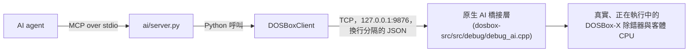

# AI Agent 使用說明

*[English](AGENT_GUIDE.md) | [繁體中文](AGENT_GUIDE.zh-TW.md)*

本文件是給 **AI agent**（或負責設定 agent 的人）使用的參考手冊：說明要安裝
什麼、如何啟動整套系統、agent 可以呼叫的每一個工具、每個工具會回傳什麼，
以及需要處理的錯誤代碼——目標是讓 agent 真正能連線並操作一個正在執行中的
DOSBox-X 工作階段。

想瞭解本專案的緣起、目前狀態與設計理念，請見 [`README.md`](README.zh-TW.md)
與 [`docs/dosbox-ai-bridge.md`](docs/dosbox-ai-bridge.md)。本文件只涵蓋
「**怎麼用**」。

## 整體架構



- agent 透過 **MCP**（Model Context Protocol）以 stdio 的方式與
  `ai/server.py` 溝通——這是您的 MCP host（宿主程式）會啟動的行程。
- `ai/server.py` 只是一層薄薄的包裝：每一次工具呼叫，最終都會轉成一次對
  `DOSBoxClient`（`ai/dosbox_client.py`）的呼叫，而它透過一個簡單的、以換行
  分隔的 JSON-RPC 協定，經由一般的 TCP socket 溝通。
- 這個 socket 就是**原生 AI 橋接層**，直接編譯進 `dosbox-x.exe` 內
  （`dosbox-src/src/debug/debug_ai.cpp`）。它只綁定在 `127.0.0.1:9876`
  （僅限本機迴路，永遠無法從機器外部連線），而且操作的是與 DOSBox-X 除錯器
  GUI 本身完全相同的除錯器狀態與中斷點機制。整條路徑上沒有第二套 CPU
  模擬器、沒有 GUI 自動化，也沒有任何虛構出來的狀態。

agent 看到的一切都是真的：真實的暫存器、真實的記憶體、真實的中斷點、真實
的執行控制，以及透過 DOSBox-X 自己的輸入處理程式碼所送出的真實鍵盤／滑鼠
輸入。

## 所需環境

| 需求 | 說明 |
|---|---|
| Windows | 原生橋接層的 socket 程式碼雖有 POSIX 分支，但本專案只建置、測試並記載了 Windows（Visual Studio）版本。 |
| Visual Studio 2019 以上，含 C++ 桌面開發工作負載 | 只需要一次，用來從 `dosbox-src` 子模組建置出 `dosbox-x.exe`。執行期不需要它。 |
| Python 3.10 以上（已用 3.12 測試過） | 用來執行 `ai/server.py` 及 `ai/` 底下其餘程式。 |
| 一個支援 MCP 的 agent host | 任何能啟動 stdio 的 MCP 伺服器並呼叫其工具的程式（Claude Code、Claude Desktop，或其他 MCP 用戶端）皆可。 |

**不需要** Node/npm——這兩者只出現在本專案最早期的建置檢查腳本
（`ai/TASK.md`）中，用於初次設定時以 MCP Inspector 做人工檢查，與一般
使用無關。

## 安裝步驟

### 1. Clone（含子模組）

```
git clone --recurse-submodules https://github.com/pmanyeh/DOSBox-X-MCP-Debugger.git
```

Windows 上的長路徑注意事項，以及 `dosbox-src` 子模組應對齊的確切 commit，
請見 `README.md`「Getting started」章節。

### 2. 建立 Python 環境

```
python -m venv .venv
.venv\Scripts\pip install -r requirements.txt
```

這會安裝鎖定版本的 `mcp==2.0.0` SDK 以及 `pytest`。

### 3. 建置原生橋接層

用 Visual Studio 開啟 `dosbox-src\vs\dosbox-x.sln`，建置 `Release`（x64）
組態；或者從命令列：

```
cd dosbox-src\vs
msbuild dosbox-x.vcxproj /p:Configuration=Release /p:Platform=x64 /m
```

（若預設的工具集無法解析，請把 `/p:PlatformToolset=...` 改成您安裝的
Visual Studio 版本對應的工具集。）本專案只更動了原始碼，沒有更動建置系統
本身——`dosbox-src` 的建置方式與上游 DOSBox-X 完全相同。這個 fork 的
`dosbox-src/vs/config.h` 預設就已經同時啟用 `C_DEBUG` 與
`C_HEAVY_DEBUG`，所以一般的建置流程就已經包含 AI 橋接層與記憶體監看點
工具所需的一切，不需要額外旗標。

建置完成後會產生 `dosbox-src\bin\x64\Release\dosbox-x.exe`。

### 4. 啟動已載入 AI 橋接層的 DOSBox-X

在專案根目錄下執行：

```
dosbox-src\bin\x64\Release\dosbox-x.exe -defaultdir -break-start drive_c\YOURPROGRAM.EXE
```

- `-break-start <程式>` 會執行該程式，並讓除錯器立刻停在其進入點——這是
  除錯工作階段最常見的起始狀態。若要附掛到一個已經以一般方式啟動的程式，
  可省略這個參數，改在執行中呼叫 `pause_execution()`。
- `-defaultdir` 可以跳過「選擇工作目錄」的資料夾選取對話框——一個從未
  執行過的 `dosbox-x.exe` 路徑，第一次啟動時會跳出這個對話框，並且會卡住
  啟動流程（AI 橋接層的 socket 也還沒開），直到有人點掉它為止。
- 一旦程式啟動，原生 AI 橋接層就會自動在 `127.0.0.1:9876` 上監聽，不需要
  額外的步驟去「啟動」橋接層——它會隨著除錯器一起啟動
  （`DEBUG_AI_Init()`，由 `DEBUG_Init()` 呼叫）。

**如果是 agent 自己啟動 `dosbox-x.exe`（而不是人類雙擊執行檔，或從一般
終端機啟動），必須讓這個行程繼承一個真正的 Win32 console——不能在建立
行程時就把 stdout／stderr 重新導向或接管到檔案。**互動式除錯器主控台
（跟 AI 橋接層「僅限停止時」的方法共用同一條程式路徑——`pause_execution`、
`cpu.get`、`read_memory` 等等，全都需要跟人類按 Ctrl+Pause 時完全相同的
`DEBUG_Loop()`／主控台機制）會在除錯器第一次真正停止時，開啟自己的
console 視窗。如果這個行程自己的 std handle 在啟動時就被重新導向／
接管，這個主控台初始化過程可能會直接讓整個 `dosbox-x.exe` 行程當掉，
連帶讓 AI 橋接層一起掛掉——已確認會在「輸出被某個工具攔截、重新導向的
shell 呼叫」下發生，也確認在「行程直接繼承啟動者自己真正的 console」時
不會發生。實務上：啟動 `dosbox-x.exe` 這個動作本身，請避免用
`> file 2>&1` 這類重新導向，或自動化工具自己的輸出攔截包裝；若需要保留
日誌，請改在 `dosbox-x.conf` 的 `[log]` 區段設定 `logfile`（直接從行程
內部寫入真正的檔案，完全不會碰到 `STD_OUTPUT_HANDLE`），而不是在作業
系統層級重新導向這個行程自己的 stdout。不需要除錯器處於停止狀態的方法
（`capture_frame`、`get_mouse_capture`、執行中的鍵盤／滑鼠輸入等）則完全
不受影響。

### 5. 讓您的 MCP host 指向 `ai/server.py`

MCP 伺服器設定範例（請自行調整成您實際 clone 的路徑）：

```json
{
  "mcpServers": {
    "dosbox-x-debugger": {
      "command": "C:\\path\\to\\DOSBox-X-AI\\.venv\\Scripts\\python.exe",
      "args": ["C:\\path\\to\\DOSBox-X-AI\\ai\\server.py"]
    }
  }
}
```

`ai/server.py` 是不受限、通用的工具介面（共 51 個工具，詳見下方），也是
一般 agent 使用時應該連線的對象。另外還有兩個 MCP 進入點，用途較為特定、
較窄，**多數 agent 不應該**連線到它們：

- `ai/server_phase5a.py`——受限的唯讀／執行控制子集，供本專案自己的
  「工具感知」測試場景使用。
- `ai/server_phase5c.py`——同樣的 12 個工具子集，但包了一層有預算、有截止
  時間、會記錄證據的受限研究框架（`--total-budget`、`--exec-budget`、
  `--deadline-seconds`、`--allowed-tools`、`--evidence-log`），用於本專案
  自己的受控驗收測試。它完全沒有暴露 Phase 6A/6B 的工具。

### 6. 驗證

先呼叫 `ping` 工具——它應該回傳 `"DOSBox-X AI Debugger is alive."`，這個
呼叫完全不需要 DOSBox-X 正在執行（它不會碰橋接層）。接著，在按照第 4
步啟動 DOSBox-X 之後，呼叫 `get_debug_status`，確認回傳的是真正的
`stopped`／`location`／`registers` 快照，而不是 `DOSBOX_NOT_CONNECTED`
錯誤。

## 可用工具

共 51 個工具，依功能分類。「前置條件」是該呼叫要求的除錯器狀態；在錯誤的
狀態下呼叫，會得到明確的錯誤（見〈[錯誤代碼](#錯誤代碼)〉），而不是卡住或
悄悄地什麼都不做。

### 工作階段／中繼資訊

| 工具 | 參數 | 回傳 | 前置條件 |
|---|---|---|---|
| `ping` | 無 | `"DOSBox-X AI Debugger is alive."` | 無（不會碰 DOSBox-X） |
| `get_project_status` | 無 | `{"project", "phase", "dosbox_bridge", "debugger", "mcp"}` | 無 |

### 除錯器狀態（唯讀）

| 工具 | 參數 | 回傳 | 前置條件 |
|---|---|---|---|
| `get_debug_status` | 無 | 停止時：`{"stopped", "running", "location": {"cs","eip"}, "instruction": {"bytes","text"}, "registers", "segments", "flags"}`；執行中時：`{"stopped": false, "running": true}` | 無 |
| `get_cpu_state` | 無 | 暫存器／區段快照 | 無——**本身並不能**證明執行已停止；若需要這項證據請改用 `get_debug_status` |
| `get_current_instruction` | 無 | 目前 CS:EIP 處的指令 | 除錯器已停止 |

### 記憶體與反組譯

| 工具 | 參數 | 回傳 | 前置條件 |
|---|---|---|---|
| `read_memory` | `address: "SEG:OFF"`、`length: int` | `{"bytes": [...]}` | 除錯器已停止 |
| `memory_search` | `start_address: "SEG:OFF"`、`length: int`、`pattern: [byte spec, ...]` 或 `text: str`、`case_sensitive: bool`、`max_matches: int` | `{"matches": ["SEG:OFF", ...], "scanned_bytes", "unreadable_regions", "truncated"}` | 除錯器已停止——完全由重複呼叫 `read_memory`組成（見 [`docs/phase8c-agent-side-analysis-tools-design.md`](docs/phase8c-agent-side-analysis-tools-design.md)），沒有新增原生 bridge 方法 |
| `disassemble` | `address: "SEG:OFF"`、`count: int` | 反組譯結果清單 | 除錯器已停止 |
| `get_call_stack` | `max_frames: int`（預設 32） | `{"frames": [{"bp": "SS:BP", "return_address": "CS:offset"}, ...], "truncated": bool}` | 除錯器已停止——透過 `get_cpu_state`／`read_memory` 走訪 SS:BP 堆疊鏈；假設標準的 PUSH BP／MOV BP,SP 前導碼與 NEAR call（見 [`docs/phase8c-agent-side-analysis-tools-design.md`](docs/phase8c-agent-side-analysis-tools-design.md)） |
| `build_control_flow_graph` | `start_address: "SEG:OFF"`、`max_blocks: int`（預設 64）、`max_instructions_per_block: int`（預設 64） | `{"blocks": {"SEG:OFF": {"instructions", "successors", "unresolved_transfer"}}, "truncated": bool}` | 除錯器已停止——對 `disassemble` 做遞迴走訪，只跟隨 NEAR／同 segment 的分支；far／間接跳轉、RET、INT 都會結束該區塊且不虛構後繼位址 |
| `write_memory` | `address: "SEG:OFF"`、`data: [0-255 的整數或 2 位十六進位字串, ...]` | 寫入確認 | 除錯器已停止 |

### 暫存器

| 工具 | 參數 | 回傳 | 前置條件 |
|---|---|---|---|
| `write_register` | `register: str`、`value: 十六進位字串` | 寫入確認 | 除錯器已停止；`register` 必須是 `eax/ebx/ecx/edx/esi/edi/ebp` 其中之一——EIP、區段暫存器、ESP、EFLAGS 一律會被拒絕（`REGISTER_NOT_WRITABLE`），以避免執行狀態失步 |

### I/O port

| 工具 | 參數 | 回傳 | 前置條件 |
|---|---|---|---|
| `write_io_port` | `port: 十六進位字串`、`value: 十六進位字串`、`width: int`（1/2/4 位元組，預設 1） | 寫入確認 | 除錯器已停止；`port` 必須是白名單內的 VGA CRTC/Sequencer/Graphics Controller/Attribute Controller/DAC/Misc Output/Feature Control port 之一，其餘一律會被拒絕（`PORT_NOT_WRITABLE`）。例如在 breakpoint 停住時，先寫 `04` 到 Graphics Controller 的 index port `3CE`，再把 plane 編號寫到 data port `3CF`，即可切換 VGA read plane——這是 `write_memory` 做不到的，因為它只能寫 guest RAM，碰不到 I/O space |

### VGA VRAM 快照

| 工具 | 參數 | 回傳 | 前置條件 |
|---|---|---|---|
| `vga_snapshot` | `regions: [{"plane": 0-3, "offset": 十六進位字串, "length": int}, ...]` | `{"layout", "plane_size_bytes", "latch", "registers": {"sequencer", "graphics_controller", "crtc"}, "regions": [{"plane", "offset", "requested_length", "returned_length", "bytes_base64"}, ...]}` | 除錯器已停止；僅限 EGA/VGA 家族機型（其餘機型會回傳 `VGA_SNAPSHOT_UNSUPPORTED`） |

直接讀取原始 VRAM，完全不經過 CPU 的 `A000:xxxx` 讀取路徑——與 `read_memory` 不同，這個工具本身不會改動 VGA latch（在 GC read-mode-0 下，任何 CPU 可見的位元組讀取都會把 latch 當成真實硬體的副作用去更新），也不需要事先切換 read plane（`write_io_port` 寫 `3CE`/`3CF`）：四個 plane、latch，以及 Sequencer／Graphics Controller／CRTC 的暫存器組，都是同一個時間點、同一次呼叫回傳的，跟最後選到哪個 plane 完全無關。這正是用來回答「畫面究竟是 guest 自己清掉的，還是診斷動作本身造成的」這類問題的工具——例如在 Mode X 程式裡讀取四個 plane 畫面最下方的位元組，完全不用去動 read-plane 暫存器（否則後續的寫入操作可能就依賴著它）。記憶體布局（`offset` 是每個 plane 內部的位元組偏移，不需乘以 4）與完整設計理由見 `docs/phase8a-vga-snapshot-design.md`。

### 中斷點

| 工具 | 參數 | 回傳 | 前置條件 |
|---|---|---|---|
| `set_breakpoint` | `address: "SEG:OFF"` | 中斷點 id | 除錯器已停止；若該位址已有中斷點則回傳 `BREAKPOINT_ALREADY_EXISTS` |
| `set_real_memory_breakpoint` | `address: "SEG:OFF"` | 中斷點 id、`"type": "memory"` | 設定當下除錯器需已停止；之後（在 continue／step 時）該位元組的值被改變時才會觸發 |
| `set_protected_memory_breakpoint` | `address: "SELECTOR:OFFSET"` | 中斷點 id、`"type": "protected_memory"` | 同上，保護模式版本 |
| `delete_breakpoint` | `breakpoint_id: int` | 刪除確認 | id 必須存在（否則 `BREAKPOINT_NOT_FOUND`）；id 是 DOSBox-X 自己中斷點清單中的**位置**，新增／刪除中斷點時會位移——不確定時請重新呼叫 `list_breakpoints` |
| `list_breakpoints` | 無 | `{"id", "address", "type", "enabled"}` 的清單，`type` 為 `"code"`、`"memory"` 或 `"protected_memory"` | 無 |

這兩個記憶體監看點工具使用 DOSBox-X 自己的位元組變化監看機制（BPPM），
只有在 heavy-debug 建置下才可用（否則回傳 `INTERNAL_ERROR`）——這個
fork 的預設建置設定已經啟用它，見〈[安裝步驟](#安裝步驟)〉。

### 執行控制

| 工具 | 參數 | 回傳 | 前置條件 |
|---|---|---|---|
| `continue_execution` | 無 | `{"stopped": false, "running": true}` | 除錯器已停止；否則回傳 `ALREADY_RUNNING` |
| `pause_execution` | 無 | CPU 真正停止後拍下的真實 `debug.status` 快照 | 客體正在執行；否則回傳 `ALREADY_STOPPED`；若在時限內未完成則回傳 `EXECUTION_TIMEOUT` |
| `step_into` | 無 | 剛好執行一個指令之後的除錯狀態快照 | 除錯器已停止；否則回傳 `ALREADY_RUNNING` |
| `step_over` | 無 | 該指令執行完之後的除錯狀態快照（若是 CALL/INT/LOOP/REP，會先讓它完整跑完） | 除錯器已停止；否則回傳 `ALREADY_RUNNING`；若被跳過的呼叫未在時限內返回則回傳 `EXECUTION_TIMEOUT`（之後可用 `get_debug_status` 確認是否隨後已完成） |

### 鍵盤輸入

本節與下一節（滑鼠輸入）裡的每個工具──但不包含 `release_all_input`
以及下方「滑鼠捕獲狀態與絕對座標定位」的工具──都會在自己原本的回傳
欄位之外，額外附上 `"queued": true, "dispatched": true,
"dispatched_at_emulated_ms": int, "input_sequence": int,
"guest_observed": "not_supported"`。`input_sequence` 是這些工具共用的
單一遞增序號空間；之後可以拿它呼叫 `get_input_receipt` 回頭查這次
dispatch（見下方「輸入 dispatch receipt」）。

| 工具 | 參數 | 回傳 | 前置條件 |
|---|---|---|---|
| `key_down` | `key: str` | `{"pressed": true}` | **客體正在執行中**（不是停止狀態）；否則回傳 `DEBUGGER_STOPPED` |
| `key_up` | `key: str` | `{"pressed": false}` | 同上 |
| `key_tap` | `key: str` | `{"tapped": true}` | 同上——最常見的用法，例如 `key_tap("enter")` 用來推進對話 |

這三個工具都是透過與 DOSBox-X 自己的 SDL 鍵盤處理常式完全相同的內部路徑
（`KEYBOARD_AddKey()`）送出——絕對不是作業系統層級的按鍵注入、視窗焦點
操作，或 GUI 自動化。

`key` 必須是以下固定白名單中的一個（無法辨識的名稱會回傳
`INVALID_PARAMETER`，不會被亂猜）：

```
數字：       1 2 3 4 5 6 7 8 9 0
字母：       q w e r t y u i o p a s d f g h j k l z x c v b n m
功能鍵：     f1 f2 f3 f4 f5 f6 f7 f8 f9 f10 f11 f12
控制鍵：     esc tab backspace enter space
修飾鍵：     leftalt rightalt leftctrl rightctrl leftshift rightshift
             capslock scrolllock numlock
標點符號：   grave minus equals backslash leftbracket rightbracket
             semicolon quote period comma slash
導覽鍵區：   printscreen pause insert home pageup delete end pagedown
方向鍵：     left up down right
數字鍵盤：   kp1 kp2 kp3 kp4 kp5 kp6 kp7 kp8 kp9 kp0
             kpdivide kpmultiply kpminus kpplus kpenter kpperiod
```

這是標準美式 104 鍵配列。Windows 鍵、F13-F24，以及日文／韓文專用按鍵目前
尚未支援。自由輸入文字（`type_text`）這個版本也還沒有——原因請見
[`docs/phase6b-input-injection-design.md`](docs/phase6b-input-injection-design.md)。

**按下的按鍵會依 MCP 工作階段個別追蹤，若連線中斷**（agent 當掉、
工作階段逾時）**而還沒呼叫 `key_up`，會自動釋放**——按鍵絕不會因為 agent
消失而永遠卡在按下狀態。也可以主動呼叫 `release_all_input` 來提前釋放。

### 滑鼠輸入

| 工具 | 參數 | 回傳 | 前置條件 |
|---|---|---|---|
| `move_mouse_relative` | `dx: 數字`、`dy: 數字` | `{"moved": true}` | 客體正在執行中；否則回傳 `DEBUGGER_STOPPED` |
| `set_mouse_button` | `button: 0\|1\|2`、`pressed: bool` | `{"pressed": bool}` | 同上 |
| `click_mouse` | `button: 0\|1\|2` | `{"clicked": true}` | 同上 |
| `release_all_input` | 無 | `{"released": true}` | 釋放此工作階段目前按住的所有按鍵／滑鼠按鍵——只要客體正在執行，隨時都可以安全呼叫，即使目前沒有按住任何東西也一樣 |

`button` 為 `0`（左鍵）、`1`（右鍵）、`2`（中鍵）。全部都是透過
`Mouse_CursorMoved()`／`Mouse_ButtonPressed()`／`Mouse_ButtonReleased()`
送出——與 DOSBox-X 自己的 SDL 滑鼠處理常式呼叫的函式完全相同。

**已知限制**：`move_mouse_relative` 只有在 DOSBox-X 的滑鼠處於捕獲狀態
（`Ctrl+F10`）、且客體正在執行會讀取相對位移的驅動程式時才會生效——這個
呼叫本身不會去切換滑鼠捕獲狀態。按鍵按下／點擊則沒有這個限制。

### 畫面截取

| 工具 | 參數 | 回傳 | 前置條件 |
|---|---|---|---|
| `capture_frame` | `format: "png"\|"rgba"`（預設 `"png"`）、`max_width: int`（選填）、`max_height: int`（選填） | `format="png"`：可直接檢視的圖片，外加中繼資料區塊（`frame_id`、`width`、`height`、`captured_at_emulated_ms`）；`format="rgba"`：`{"frame_id", "width", "height", "pixel_format": "rgba8888", "rgba_base64", ...}` | 停止或執行中皆可呼叫，但請見下方說明 |

擷取的是客體自己算出來的畫面本身——絕對不是 DOSBox-X 視窗、主機桌面，或
任何其他主機視窗——透過的是與 DOSBox-X 自己的截圖／AVI 錄影功能完全相同
的內部掛鉤點。整個過程絕不會寫入主機磁碟。想直接看畫面時用預設的
`"png"`；需要精確的像素值（例如比對某個已知座標的顏色）而不是用眼睛看時
用 `"rgba"`。

`max_width`／`max_height` 會在原生畫面超過這個尺寸時做等比例的最近鄰縮小；
兩者都不填就維持原生解析度。若編碼後的畫面仍超過橋接層的大小上限，呼叫會
失敗並回傳 `FRAME_TOO_LARGE`，錯誤訊息裡會附上建議縮小後的
`max_width`／`max_height`——絕不會偷偷把畫面截斷。

**完全停止的客體不會產生新的畫面**（VGA 畫面更新的時機是由只有在客體真正
執行時才會觸發的硬體事件驅動）——在除錯器停止時呼叫 `capture_frame`，
通常會逾時（`EXECUTION_TIMEOUT`）而不是立刻回傳結果。要穩定擷取，請先呼叫
`continue_execution()`。

### 最終合成畫面擷取

| 工具 | 參數 | 回傳 | 前置條件 |
|---|---|---|---|
| `capture_composite` | `format: "png"\|"rgba"`（預設 `"png"`）；以下三者至多擇一：`crop: "viewport"\|"full"`（預設 `"viewport"`）、`game_rect: {"x","y","w","h"}`（guest 原生像素座標）、`rect: {"x","y","w","h"}`（back buffer 像素座標）；`max_width`／`max_height: int`（選填）；`include_source: bool`（預設 `false`） | `format="png"`：中繼資料加上合成畫面（`include_source=true` 時再附上同一個 frame 的 `capture_frame` 影像）；中繼資料包含 `backend`、`target_render_seq`／`presented_render_seq`／`source_frame_match`、`width`／`height`、`crop_rect`、`scaled`，以及 `geometry`（`backbuffer`、`viewport`、`draw`、`render_src`、`guest_native`、`scale`、`aspect_correction`、`fullscreen`、`pixel_shader`） | 客體需在執行中（停止時會逾時）；需為 `output=direct3d` 或 `output=surface` |

回傳的是輸出 backend 的**最終合成畫面**——也就是 DOSBox-X 即將 present
到螢幕上的那張 back buffer，已經過縮放、濾鏡、pixel shader 與
letterbox 處理——而且是在 DOSBox-X 內部、present 之前讀回，所以就算有其他
視窗蓋住 DOSBox-X 也不受影響（主機滑鼠游標不會出現在畫面中）。

**該用哪一個擷取工具：**

| | `capture_frame` | `capture_composite` |
|---|---|---|
| 擷取層 | Scaler 之前的 guest 原生畫面 | Backend present 前的最終畫面 |
| 解析度 | Guest 解析度（mode 13h 為 640×400） | Back buffer 解析度（視窗或全螢幕） |
| 包含 shader、濾鏡、letterbox | 否 | 是 |
| 包含 Modern overlay | 否 | 是（M6 之後） |
| 適合用途 | 比對 DOS framebuffer、CRC、找像素 | 驗收玩家實際看到的畫面、overlay 位置、清晰度 |

**規則：判斷 HiRes 文字是否清晰、位置是否正確，一律使用
`capture_composite` 搭配 `game_rect` 裁切。** `game_rect` 使用 guest 的
原生座標（`geometry.guest_native`，mode 13h 為 320×200——不是
`capture_frame` 的 640×400）；bridge 會依 `geometry.viewport` 換算（左上角
取 floor、右下角取 ceil）。`crop="full"` 會包含 letterbox／pillarbox 黑邊。

`include_source=true` 會一併回傳**同一個** emulated frame 的
`capture_frame` 影像；當合成畫面正是由該 frame present 出來時，
`source_frame_match` 為 `true`。客體畫面靜止時也能立刻擷取——有待處理的
請求時，renderer 會做一次完整重繪，確保會有一個 frame 被 present。目前只
支援 `direct3d`（Windows 預設）與 `surface`；其他 backend 會回傳
`COMPOSITE_UNSUPPORTED_BACKEND`，**絕不會**退回 `capture_frame` 的結果。
請優先使用 `"png"`：1080p 的 `"rgba"` 只是剛好塞進 8 MiB 上限，更大的畫面
會回傳 `FRAME_TOO_LARGE`。

### 滑鼠捕獲狀態與絕對座標定位

| 工具 | 參數 | 回傳 | 前置條件 |
|---|---|---|---|
| `get_mouse_capture` | 無 | `{"captured", "autolock", "mode": "absolute"\|"relative"\|"unavailable", "guest_width", "guest_height", "last_guest_x", "last_guest_y"}` | 停止或執行中皆可呼叫 |
| `set_mouse_capture` | `captured: bool` | 與 `get_mouse_capture` 相同結構 | 停止或執行中皆可呼叫；不支援時回傳 `CAPTURE_UNAVAILABLE` |
| `move_mouse_absolute` | `x: 數字`、`y: 數字`、`coordinate_space: "guest_pixels"\|"normalized"`（預設 `"guest_pixels"`）、`clamp: bool`（預設 `false`） | `{"queued", "dispatched", "guest_x", "guest_y", "coordinate_space": "guest_pixels", "clamped", "input_sequence"}` | 客體正在執行中；否則回傳 `DEBUGGER_STOPPED` |
| `click_at` | 同 `move_mouse_absolute`，外加 `button: 0\|1\|2`（預設 `0`） | 同 `move_mouse_absolute`，外加 `"clicked": true` | 同上 |

`set_mouse_capture` 的效果跟使用者按下 `Ctrl+F10` 完全相同——絕不會移動
主機游標、改變視窗焦點，或影響任何其他程式。`move_mouse_absolute`／
`click_at` 走的是 DOSBox-X 自己既有的無縫／整合滑鼠定位內部路徑——跟
`move_mouse_relative` 不同，這兩個呼叫都不需要滑鼠處於捕獲狀態。

`get_mouse_capture` 回傳的 `guest_width`／`guest_height` 一定跟
`capture_frame` 回報的當前畫面寬高一致（兩者都源自同一份 DOSBox-X
render 狀態），所以可以直接把 `capture_frame` 截圖裡挑到的像素座標，原封
不動地傳給 `click_at` 的 `"guest_pixels"` 座標空間——也就是「看畫面、點
座標」這個自然的流程。`"normalized"` 座標空間是 `[0.0, 1.0] x [0.0,
1.0]`，原點在左上角。超出範圍的座標若 `clamp=false` 會回傳
`INVALID_PARAMETER`；`clamp=true` 則會夾到合法範圍內。

**`guest_pixels` 是「螢幕截圖像素空間」，不是遊戲視訊模式的原生／標稱
解析度——請不要假設兩者相同。** DOSBox-X 自己的顯示層，對低解析度的
視訊模式會做像素倍增（及／或掃描線倍增）以利螢幕顯示——最典型的例子就是
Mode 13h（`INT 10h` `AH=00h`、`AL=13h`），它的標稱解析度是 320×200，但
實際渲染／截圖出來的畫面是 640×400（DOSBox-X 自己的 `dblw`／`dblh`
渲染旗標把兩個軸都放大了一倍）。`guest_width`／`guest_height` 回報的
永遠是**渲染後**的尺寸（640×400，跟 `capture_frame` 的輸出一致），
**絕不是**遊戲的標稱 320×200。如果你自己的工具是依照遊戲的原生／標稱
解析度去計算目標座標（例如直接讀 VRAM，或是拿 320×200 原生解析度的
參考圖做比對），而不是依照真正的 `capture_frame` 截圖去計算，那麼在呼叫
`move_mouse_absolute`／`click_at` 之前，必須自行把座標放大到
`guest_width`／`guest_height` 的比例——像這種被放大一倍的模式，如果直接
把原生解析度的數字當成 `"guest_pixels"` 送出去，兩個軸都會剛好落在
預期位置的一半處。請務必先呼叫 `get_mouse_capture`，並依照它實際回報的
`guest_width`／`guest_height` 去換算座標，不要假設任何固定的解析度。

**已知限制**：只有在 `get_mouse_capture` 的 `"mode"` 是 `"absolute"` 時，
絕對座標定位才可用——例如已啟動的客體作業系統，或沒有 virtual-8086 的
保護模式，會回報 `"relative"`，此時 `move_mouse_absolute`／`click_at`
會回傳 `ABSOLUTE_MOUSE_UNAVAILABLE`。`"last_guest_x"`／`"last_guest_y"`
是橋接層最後一次成功送達的座標——不是「客體程式真的讀到了」的保證（跟本
指南其他地方 `guest_observed` 類的警語一致）。

### 輸入 dispatch receipt

| 工具 | 參數 | 回傳 | 前置條件 |
|---|---|---|---|
| `get_input_receipt` | `input_sequence: int` | `{"queued", "dispatched", "dispatched_at_emulated_ms", "input_sequence", "guest_observed": "not_supported", "device": "keyboard"\|"mouse", "guest_observation": {"kind": null, "observed_at_emulated_ms": null}}` | 停止或執行中皆可呼叫；若該序號目前沒保留，回傳 `INPUT_RECEIPT_EXPIRED` |

用先前呼叫回傳的 `input_sequence`，回頭查一次鍵盤／滑鼠 dispatch——適合
在事後確認某次按鍵或點擊真的送到了
`KEYBOARD_AddKey()`／`Mouse_CursorMoved()`／`Mouse_ButtonPressed()`／
`Mouse_ButtonReleased()`，而不只是「RPC 呼叫本身成功回傳」。橋接層至少
會保留最近 4096 筆 dispatch 或最近 10 分鐘的資料，以先達到的門檻為準；
`INPUT_RECEIPT_EXPIRED` 不會區分「已被淘汰」跟「根本沒發過這個序號」。

本實作中 `"guest_observed"` 與 `"guest_observation"` 永遠是
`"not_supported"`／`null`——確認 DOS／BIOS 端的輸入狀態真的改變了（而不
只是橋接層送出去了），是留給未來 phase 的保留欄位，本指南不應該被理解
成這件事已經做到了。要驗證某次 dispatch 真的影響了客體，請改用
`capture_frame` 或記憶體監看點搭配確認。

### 中斷點命中前後的執行 trace

| 工具 | 參數 | 回傳 | 前置條件 |
|---|---|---|---|
| `configure_execution_trace` | `enabled: bool`、`before_instructions: 0..4096`（預設 `0`）、`after_instructions: 0..4096`（預設 `0`）、`registers: list[str]`（選填，預設全部 `ax/bx/cx/dx/si/di/bp/sp/cs/ip/flags`）、`include_disassembly: bool`（預設 `true`）、`max_trace_bytes: 65536..4194304`（預設 `65536`） | `{"enabled", "configuration": {...}}` | 停止或執行中皆可呼叫；沒有 heavy-debug 支援時回傳 `INTERNAL_ERROR` |
| `list_execution_traces` | `limit: 1..100`（預設 `100`）、`after_trace_id: int`（選填） | `{"traces": [{"trace_id", "trigger", "before_count", "after_count", "complete_after"}, ...], "dropped_traces"}` | 停止或執行中皆可呼叫 |
| `get_execution_trace` | `trace_id: int` | `{"trace_id", "trigger": {"kind", "breakpoint_id", "location", "emulated_ms"}, "before": [InstructionRecord, ...], "after": [InstructionRecord, ...], "complete_after", "dropped_instruction_count"}` | 停止或執行中皆可呼叫；若該 trace 目前沒保留，回傳 `TRACE_NOT_FOUND` |

當 `configure_execution_trace(enabled=true)` 生效時，每次除錯器真正
停止——不論是程式碼／記憶體中斷點、手動呼叫 `pause_execution()`／
Ctrl+Pause，還是 `-break-start`——都會自動擷取一筆 trace，不需要每次
停止前另外呼叫「開始追蹤」。每個 `InstructionRecord` 都是
`{"ordinal", "location": "CS:IP", "bytes_hex", "disassembly",
"registers": {...}}`。`trigger.kind` 是 `"code_breakpoint"`、
`"memory_breakpoint"` 或 `"manual_pause"`；`trigger.breakpoint_id` 是
**擷取當下**的中斷點 id（一個快照——即使之後對這個 id 呼叫
`delete_breakpoint`，這裡仍然讀得到）。

**若 `after_instructions > 0`，除錯器本身可見的停止位置會跟著移動**：
擷取完 trace 之後，橋接層會自動再執行 `after_instructions` 個指令才
把控制權交還——這之後呼叫 `get_debug_status`／`get_cpu_state`，會看到
CPU 停在原本觸發點之後 `after_instructions` 個指令的地方，而不是觸發點
本身（trace 自己的 `before`／`after` 陣列會同時顯示兩個位置）。如果在
這段自動執行期間又命中了另一個中斷點，`complete_after` 會是
`false`（目前為止收集到的部分 `after` 仍然有效）。

**對 `code_breakpoint`／`memory_breakpoint` 觸發而言，`before` 的最後
一筆就是觸發指令本身**（DOSBox-X 底層的指令記錄機制，會在檢查是否為
中斷點之前就先記下這個指令）**——但對 `manual_pause` 而言，`before`
會比觸發位置少一筆**（手動暫停是在底層記錄機制自己的逐指令檢查「之間」
插入的，所以暫停當下那個指令從未被記錄過）。這是底層機制本來就有的
特性，不是需要規避的 bug。

**已知限制**：重用的是 DOSBox-X 自己既有的 heavy-debug 指令記錄（跟它
「LOG HEAVY」除錯器主控台指令用的是同一份狀態），所以若有人同時在主控台
用那個指令，會共用同一份狀態。如果 trace 剛啟用不久，`before` 可能回傳
少於 `before_instructions` 筆（絕不會回傳啟用之前的舊資料）。初版僅支援
real-mode x86、單一 CPU、無條件中斷點——不支援分支追蹤或原始碼層級的
symbol。

### DOS 檔案 I/O 事件記錄

| 工具 | 參數 | 回傳 | 前置條件 |
|---|---|---|---|
| `configure_dos_io_log` | `enabled: bool`、`operations: list[str]`（選填，預設全部 `open/close/read/write/seek`）、`path_globs: list[str]`（選填，預設所有路徑）、`include_failed: bool`（預設 `true`）、`max_events: 100..100000`（預設 `10000`） | `{"enabled", "max_events"}` | 停止或執行中皆可呼叫 |
| `list_dos_io_events` | `limit: 1..1000`（預設 `1000`）、`after_event_id: int`（選填）、`operation: str`（選填）、`path_glob: str`（選填） | `{"events": [DosIoEvent, ...], "dropped_events"}` | 停止或執行中皆可呼叫 |
| `clear_dos_io_log` | 無 | `{"cleared": true}` | 停止或執行中皆可呼叫 |

啟用期間，每一次完成的 real-mode `INT 21h`
`open`(3Dh)／`close`(3Eh)／`read`(3Fh)／`write`(40h)／`seek`(42h) 呼叫都
會被記錄下來，附上真實的呼叫後結果——實際傳輸的位元組數、`AX`、carry、
DOS 錯誤碼——絕不只是請求本身。每筆 `DosIoEvent`：
`{"event_id", "emulated_ms", "operation", "phase": "completed", "cs_ip",
"process": {"psp_segment"}, "handle", "path_dos", "path_host",
"file_offset_before", "requested_bytes", "transferred_bytes",
"buffer": {"segment", "offset", "linear"},
"result": {"carry", "ax", "dos_error"}}`。

`path_host` 只有在真正掛載到主機目錄的磁碟（一般 `MOUNT C <路徑>`
這種）才會有值——image 掛載／ISO／網路磁碟一律是 `null`，絕不用猜的。
`buffer.linear` 可以讓你把一次 `read` 跟之後設在同一個位址的記憶體監看點
對照起來——完整範例見 `docs/case-study-dark-sun-gpli-debugging.md`。
`path_globs`（`*`／`?` 萬用字元，不分大小寫）的篩選發生在事件被記錄
**之前**——不符合的事件根本不會佔用環狀緩衝區，不只是在 `list` 裡被
藏起來而已。

**已知限制**：只涵蓋上面這五個服務——不支援 FCB 檔案存取、`EXEC`，或
DOS extender／protected-mode 檔案 I/O。很多 DOS shell 內建指令（例如
`TYPE`）內部用的是比較舊的 FCB 式檔案存取路徑，而不是這裡記錄的現代
handle 式呼叫，所以就算啟用了記錄，這些指令也不會出現在記錄裡——這是
預期行為，不是 bug；如果要確認記錄功能正常運作，請用一個會自己呼叫
現代 handle API（`AH=3Dh` 等）的程式來測試。寫入的內容本身永遠不會被
擷取，只有中繼資料——如果需要實際的位元組內容，請自行用 `buffer.linear`
搭配 `read_memory` 讀取。

### Agent 端知識庫

| 工具 | 參數 | 回傳 | 前置條件 |
|---|---|---|---|
| `set_symbol` | `address: "SEG:OFF"`、`name: str` | `{"address", "name"}` | 無——完全不會碰 DOSBox-X |
| `get_symbol` | `address: "SEG:OFF"` | `{"address", "name"}`（未設定時 `name` 為 `null`） | 無 |
| `delete_symbol` | `address: "SEG:OFF"` | `{"address", "deleted": bool}` | 無 |
| `list_symbols` | 無 | `{"symbols": [{"address", "name"}, ...]}` | 無 |
| `set_comment` | `address: "SEG:OFF"`、`text: str` | `{"address", "text"}` | 無 |
| `get_comment` | `address: "SEG:OFF"` | `{"address", "text"}`（未設定時 `text` 為 `null`） | 無 |
| `add_xref` | `from_address: "SEG:OFF"`、`to_address: "SEG:OFF"`、`kind: "call"\|"jump"\|"data"\|"other"`（預設 `"call"`） | `{"from", "to", "kind"}` | 無 |
| `list_xrefs` | `address: "SEG:OFF"`、`direction: "to"\|"from"\|"both"`（預設 `"to"`） | `{"address", "xrefs": [{"from", "to", "kind"}, ...]}` | 無 |

一個持久化、agent 端（完全不在 DOSBox-X 或原生 bridge 裡）的資料庫，
記錄 agent 在一次工作階段中學到的符號、註記與交叉引用，讓它不必每次
都重新推敲同一個位址的意義。預設持久化到 `ai/knowledge.local.json`
（已加入 `.gitignore`——這是您自己的研究成果，不是專案原始碼）。每個
位址都會正規化（`segment = linear_address >> 4, offset = linear_address
& 0xF`），所以 `set_symbol("1234:0100", ...)` 之後用
`get_symbol("1244:0000")`（或同一個 linear 位址的任何其他 "SEG:OFF"
寫法）都能查到同一筆資料。`add_xref` 具有冪等性——重複新增同一組
`(from, to, kind)` 不會產生重複項目。這些工具都不會回傳 DOSBox-X 的
錯誤代碼（不合法輸入只會產生一般的參數錯誤），因為它們完全不會碰到
原生 bridge。詳見
[`docs/phase8c-agent-side-analysis-tools-design.md`](docs/phase8c-agent-side-analysis-tools-design.md)。

## 錯誤代碼

每一次失敗都會以結構化的 `{"code", "message"}` 錯誤回傳（絕不是原始例外
或悄悄地什麼都不做）。以下是 agent 應該特別辨識、分別處理的代碼：

| 代碼 | 意義 | 建議處理方式 |
|---|---|---|
| `DEBUGGER_NOT_STOPPED` | 在執行中呼叫了「僅限停止時」的工具，且除錯器來不及即時停下 | 先呼叫 `pause_execution`，或先檢查 `get_debug_status` |
| `DEBUGGER_STOPPED` | 在停止狀態呼叫了「僅限執行中」的工具（輸入注入） | 先呼叫 `continue_execution` |
| `ALREADY_RUNNING` | 在已經執行中時呼叫 `continue_execution`／`step_into`／`step_over` | 先檢查 `get_debug_status` |
| `ALREADY_STOPPED` | 在已經停止時呼叫 `pause_execution` | 先檢查 `get_debug_status` |
| `EXECUTION_TIMEOUT` | `pause_execution`／`step_over` 未在時限內完成 | 呼叫 `get_debug_status`——它可能隨後已經完成 |
| `MEMORY_ERROR` | 要求的客體記憶體未對應／無法存取 | 不要用同樣的位址重試 |
| `REGISTER_NOT_WRITABLE` | 該暫存器不在可寫入白名單中 | 不要重試 |
| `BREAKPOINT_NOT_FOUND` | 該中斷點 id 目前不存在 | 呼叫 `list_breakpoints` 取得目前的 id |
| `BREAKPOINT_ALREADY_EXISTS` | 該位址已經有中斷點 | 直接使用既有的，或先 `delete_breakpoint` |
| `INVALID_PARAMETER` | 參數格式錯誤／超出範圍／無法辨識（例如未知的按鍵名稱、錯誤的滑鼠按鍵編號） | 修正參數後再試，不要原樣重試 |
| `INVALID_ADDRESS` | `"SEG:OFF"`／`"SELECTOR:OFFSET"` 字串格式錯誤 | 修正位址格式 |
| `INTERNAL_ERROR` | 原生橋接層本身的失敗，例如在非 heavy-debug 建置上設定記憶體監看點 | 除非改變建置／環境，否則無法重試 |
| `FRAME_TOO_LARGE` | `capture_frame`／`capture_composite` 編碼後的影像超過橋接層的大小上限 | 用錯誤訊息裡的 `suggested_max_width`／`suggested_max_height` 重試，或縮小裁切範圍 |
| `CROP_OUT_OF_BOUNDS` | `capture_composite` 的 `crop`／`rect`／`game_rect` 超出 back buffer 或 guest 原生座標範圍，或寬高為 0 | 先用 `crop="full"` 擷取一次取得 `geometry`，再修正矩形 |
| `COMPOSITE_UNSUPPORTED_BACKEND` | 目前的輸出 backend 不是 `direct3d`／`surface` | 改用 `output=direct3d`（或 `surface`）重新啟動；或在清楚知道它是 scaler 之前畫面的前提下改用 `capture_frame` |
| `COMPOSITE_UNSUPPORTED_FORMAT` | Back buffer 的像素格式無法轉成 RGBA8888 | 不改顯示設定就無法重試 |
| `COMPOSITE_DEVICE_LOST` | 整個請求期間 Direct3D device 都處於 lost 狀態（例如切換全螢幕途中） | 稍後重試 |
| `CAPTURE_UNAVAILABLE` | 呼叫 `set_mouse_capture` 時，目前的畫面輸出後端沒有可控制的捕獲狀態 | 目前本 fork 已知的建置都不會產生這個錯誤 |
| `ABSOLUTE_MOUSE_UNAVAILABLE` | 呼叫 `move_mouse_absolute`／`click_at` 時，絕對座標定位在客體目前的模式下無法使用 | 先檢查 `get_mouse_capture` 的 `"mode"` 欄位 |
| `INPUT_RECEIPT_EXPIRED` | `get_input_receipt` 的 `input_sequence` 目前沒有被保留 | 該序號無法重試——已被淘汰，或根本沒發過 |
| `TRACE_NOT_FOUND` | `get_execution_trace` 的 `trace_id` 目前沒有被保留 | 該 id 無法重試——已被淘汰，或根本沒發過 |
| `DOSBOX_NOT_CONNECTED` | 用戶端層級：橋接層無法連線（DOSBox-X 未執行，或建置時未啟用 `C_DEBUG`） | 啟動或重新啟動 DOSBox-X |
| `DOSBOX_TIMEOUT` | 用戶端層級：橋接層未在時限內回應 | 通常是暫時性的；也可能代表 DOSBox-X 卡住了 |

## 範例工作流程

### 基本的設中斷點／檢視／單步流程

```
set_breakpoint("1000:0100")
continue_execution()
# ……中斷點觸發，除錯器真正停在該處……
get_debug_status()              # 確認已停止，查看暫存器／位置
read_memory("1000:0100", 16)
step_into()
get_cpu_state()
delete_breakpoint(0)
```

### 記憶體監看點＋輸入注入（這兩組工具正是為了這個場景而生——不需要
任何人手動點擊或打字，就能推進一個文字冒險／對話系統）

```
set_real_memory_breakpoint("0060:1234")   # 監看某個文字指標／緩衝區位元組
continue_execution()
key_tap("enter")                          # 推進客體的對話
# ……客體寫入被監看的位元組，執行在那裡停下……
get_debug_status()                        # 寫入發生後當下真實的 CS:EIP
read_memory("<cs>:<某個偏移>", 64)         # 檢視來源緩衝區
disassemble("<cs>:<eip>", 10)             # 向前／向後追蹤呼叫者
key_tap("enter")                          # 觸發下一步
```

## 限制與安全注意事項

- 橋接層只綁定在 `127.0.0.1`——絕對不要把 `9876` 這個 port 對外開放。
- 單一個 `DOSBoxClient` 連線並非執行緒安全，一次只能有一個請求在飛行中
  （對應原生橋接層「每條連線一次只處理一個請求」的設計）。一個 MCP
  工作階段本身自然就會滿足這個限制。
- 記憶體監看點（`set_real_memory_breakpoint`、
  `set_protected_memory_breakpoint`）需要 heavy-debug 建置——這個 fork
  預設就已經啟用，見〈[安裝步驟](#安裝步驟)〉。
- 目前版本的鍵盤輸入是固定的名稱白名單，不支援自由文字或原始 scan code。
- 滑鼠相對位移是否生效，取決於 DOSBox-X 的滑鼠捕獲狀態，而這組工具本身
  並不會去控制那個狀態。
- `capture_frame` 目前還不支援 `include_cursor: true`（會回傳
  `INVALID_PARAMETER`）——客體游標合成是一個明確記錄下來的待解問題，
  而不是被悄悄忽略。
- 這是一個工程預覽版本，還不是成品——依賴它做無人值守、高風險的用途之前，
  請先參閱 `README.md` 中誠實揭露的 Phase 5C 驗收結果。
