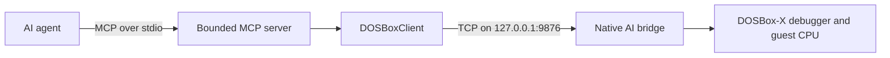

# DOSBox-X MCP Debugger

*[English](README.md) | [繁體中文](README.zh-TW.md)*

An experimental MCP integration that lets AI agents inspect and control the
native DOSBox-X debugger through a bounded, auditable tool interface.

The project is intended for DOS program debugging and reverse-engineering
research, including investigation of legacy game data flows such as runtime
text decoding, phrase composition, script execution, and rendering pipelines.

> [!IMPORTANT]
> This is an engineering preview. The real MCP transport and enforcement layers
> are implemented and tested, but formal Phase 5C autonomous-agent acceptance is
> **NOT PASS**: 3 of 4 representative agent scenarios passed. See
> [`docs/phase5c-final-report.md`](docs/phase5c-final-report.md) for the complete,
> unabridged result.

## Why this project exists

Traditional AI-assisted debugging often requires a person to act as a manual
relay:

1. the AI suggests a breakpoint or debugger action;
2. the person performs it in the GUI;
3. the person copies registers, memory, or disassembly back to the AI;
4. the process repeats one instruction at a time.

DOSBox-X MCP Debugger removes that relay. An agent can use native MCP tools to
observe and control the same DOSBox-X debugger and guest CPU that a human sees,
while every request remains bounded and traceable.

## Architecture



The project deliberately does **not** introduce:

- GUI automation;
- a second CPU emulator;
- a parallel breakpoint implementation;
- fabricated debugger state.

Breakpoints, stepping, execution control, register reads, memory reads, and
disassembly are backed by the native DOSBox-X debugger mechanisms.

## Agent-visible tools

This section covers the bounded Phase 5C research surface specifically
(used for this project's own controlled acceptance testing). For the
general-purpose, unbounded 25-tool surface a normal agent should actually
connect to, see the [AI Agent Usage Guide](AGENT_GUIDE.md).

The current bounded Phase 5C surface exposes 12 tools:

| Category | Tools |
| --- | --- |
| Debugger state | `get_debug_status`, `get_cpu_state`, `get_current_instruction` |
| Inspection | `read_memory`, `disassemble` |
| Breakpoints | `set_breakpoint`, `delete_breakpoint`, `list_breakpoints` |
| Execution | `continue_execution`, `pause_execution`, `step_into`, `step_over` |

`get_cpu_state` returns a register snapshot. It does not, by itself, prove that
execution is stopped. Agents requiring running/stopped evidence must call
`get_debug_status`.

Register and memory write capabilities are intentionally **not exposed** by the
Phase 5C agent-facing MCP server.

## Bounded sessions

Each bounded debugging session owns its own:

- allowed-tool policy;
- total-call budget;
- execution-operation budget;
- monotonic watchdog deadline;
- terminal state;
- machine-readable evidence log.

A rejected request must stop before `DOSBoxClient`, must not reach the native
bridge, and must not change DOSBox-X state.

## Current project status

### Phase 5C result

| Layer | Result |
| --- | --- |
| C1 — real MCP connectivity | **PASS** |
| C2 — transport equivalence | **PASS** |
| C3/C3-E — bounded enforcement through real MCP | **PASS** |
| C4 — fresh autonomous-agent debugging | **NOT PASS** (3/4 composed evidence) |
| C5 — regression and frozen-state verification | **PASS** |

The recurring C4 failure was narrow but meaningful: two independent fresh
agents completed the intended breakpoint/run/register workflow, but used
`get_cpu_state` as their final observation without independently confirming the
stopped state through `get_debug_status`.

This result is preserved rather than hidden or repeatedly rerun until a pass.
The transport implementation is usable for controlled research, but the project
does not claim complete autonomous-agent reliability.

### Regression evidence at closeout

- Phase 5C deterministic suite: **23/23 passed**
- Phase 5A live regression: **16/16 passed**
- Phase 5B regression: **40/40 passed**
- Offline debugger regression: **17/17 passed**

The implementation checkpoint is commit
`8357b435c39d5ad2e589bc611ce15f868fa78cdf`.

## Intended workflow

A typical reverse-engineering investigation is expected to look like this:

1. A human reproduces a target event in a DOS program or game.
2. The agent inspects the debugger and installs candidate breakpoints.
3. The human triggers the event when necessary.
4. The agent follows execution, memory, and disassembly through native MCP
   tools.
5. The session produces an evidence trace separating observations, inferences,
   and unresolved questions.

The first planned real-game proof-of-value pilot will investigate how one
reproducible line of game text is formed before it reaches the renderer: as a
complete string, a sequence of appended phrases, a token stream, or a template
with runtime substitutions.

## Repository layout

```text
ai/                 MCP servers and DOSBox client integration
docs/               architecture, phase designs, and acceptance reports
tests/phase5a/       tool-awareness acceptance infrastructure
tests/phase5b/       bounded-autonomy acceptance infrastructure
tests/phase5c/       real-MCP transport and evidence tests
dosbox-src/          DOSBox-X Native AI Bridge fork, tracked as a git submodule
```

## Getting started

`dosbox-src` is a git submodule pointing at
[`pmanyeh/dosbox-x`](https://github.com/pmanyeh/dosbox-x), branch
`ai-mcp-bridge`, pinned at commit `5fcf624b787e1017273b313de6f9a70f12422102`
(the Native AI Bridge on top of an unmodified upstream DOSBox-X base). Cloning
it and resolving to that exact commit has been independently verified via a
disposable fresh clone (see `docs/phase5c-final-report.md`).

### Clone

> [!IMPORTANT]
> On Windows, the upstream DOSBox-X history contains some long file paths
> (under `docs/PLANS/`, `ref/`). Combined with a deeply nested clone
> destination, `git submodule update --init` can fail with `Filename too
> long`. Before cloning, run once:
>
> ```
> git config --global core.longpaths true
> ```
>
> and clone into a short path (e.g. `C:\dev\DOSBox-X-MCP-Debugger`), not deep
> inside `AppData`/`Temp`/similarly long default locations.

```
git clone --recurse-submodules https://github.com/pmanyeh/DOSBox-X-MCP-Debugger.git
```

(or, if already cloned without `--recurse-submodules`: `git submodule update
--init`.)

### Python environment (verified against `requirements.txt`)

```
python -m venv .venv
.venv\Scripts\pip install -r requirements.txt
```

This installs the pinned `mcp==2.0.0` SDK and `pytest`.

### Building the native bridge

`dosbox-src` builds the same way upstream DOSBox-X does on Windows -- this
project changes source files, not the build system. Follow
[`dosbox-src/README.development-in-Windows`](https://github.com/pmanyeh/dosbox-x/blob/ai-mcp-bridge/README.development-in-Windows)
(Visual Studio 2019+, the `vs/dosbox-x.sln` solution). **A from-scratch build
on a fresh machine has not been independently re-verified as part of this
audit** -- what has been verified this session is running the already-built
binary against the current bridge source (63/63 native-bridge protocol
checks, plus the full Phase 5A/5B/5C test suites, all passing). Please report
any build friction.

### Health checks

`bin/` (the build output, including `dosbox-x.conf`) is not tracked by
`dosbox-src` -- it's produced by the build above. On first launch, DOSBox-X
will prompt once for a working directory; choose the repository root and
(optionally) save it so future launches skip the prompt:

```
dosbox-src\bin\x64\Release\dosbox-x.exe -break-start drive_c\STEP.COM
.venv\Scripts\python.exe tests\test_native_bridge.py
```

63/63 checks should pass. Then, optionally, the fuller suites:

```
.venv\Scripts\python.exe -m pytest tests\phase5c -q
.venv\Scripts\python.exe -m pytest tests\phase5b -q
.venv\Scripts\python.exe -m pytest tests\test_debugger.py -q
```

(`tests/phase5c` and `tests/phase5b`'s live cases need a freshly-launched
DOSBox-X per the scenario's target program, `STEP.COM` or `TEST.COM` -- see
`tests/phase5c/scenario_setup.py` for the exact launch/positioning helpers
this project's own test runs use.)

### Cleanup

Nothing under `scratchpad/` (session-local: campaign traces, generated MCP
configs, OAuth/preflight artifacts, evidence logs) is meant to persist or be
committed -- it's safe to delete at any time and is already `.gitignore`d.

## Security and privacy

- The native bridge binds to loopback (`127.0.0.1`) rather than a public
  interface.
- MCP tool availability is controlled per bounded session.
- Rejected operations are recorded but not forwarded.
- Credentials, OAuth state, generated MCP configs, local traces, virtual
  environments, and build products must not be committed.
- Commercial game executables, data, saves, manuals, screenshots, and extracted
  assets are not part of this repository.

## Documentation

- **[AI Agent Usage Guide](AGENT_GUIDE.md)** -- required environment,
  installation, every MCP tool an agent can call, error codes, and example
  workflows. Start here if you're connecting an agent to this project.
- [Phase 5C transport design](docs/phase5c-real-mcp-transport-design.md)
- [Phase 5C final report](docs/phase5c-final-report.md)
- [Phase 5C implemented-state checkpoint](docs/phase5c-implemented-state-checkpoint.md)

## Project scope

This repository provides a general debugger integration. Game-specific research,
translations, extracted data, and patches should live in separate repositories
and should connect to this tool through project-level MCP configuration.

## License and affiliation

The `dosbox-src` submodule (`pmanyeh/dosbox-x`) is a fork of upstream
DOSBox-X and remains under upstream's own **GNU General Public License v2**
(see `dosbox-src/COPYING`); the Native AI Bridge changes carry the same
GPL-2.0 header and copyright attribution as the files they extend, and no
upstream license or copyright notice has been altered.

> [!IMPORTANT]
> **This repository's own original code (the Python MCP server, bounded
> session, and test/acceptance infrastructure under `ai/` and `tests/`) does
> not yet have a selected license.** No license file has been added, and none
> should be inferred. Until an explicit license is chosen, default copyright
> applies (all rights reserved to the author) to that original code. This is
> a real open decision, not an oversight -- it intentionally has not been
> guessed at as part of this publication.

This project is independent and is not an official DOSBox-X project or an
official product of any AI model or service provider.

