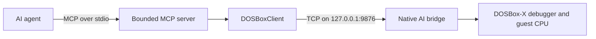

# DOSBox-X MCP Debugger

*[English](README.md) | [繁體中文](README.zh-TW.md)*

> **Give AI agents direct, structured access to the real DOSBox-X debugger.**

DOSBox-X MCP Debugger connects AI agents to the native DOSBox-X debugger through
the Model Context Protocol (MCP). Instead of asking a person to copy registers,
memory dumps, disassembly, and breakpoint results back and forth, an agent can
inspect and control the same guest CPU and debugger state directly.

It is built for **legacy DOS debugging and reverse engineering**, especially
investigations where runtime evidence matters: discovering how text is decoded
or assembled, following script execution, tracing rendering pipelines, watching
memory changes, and reproducing input-dependent behavior.

## What it enables

The current general-purpose MCP interface exposes **37 tools** across the
debugging workflow:

| Area | Examples |
| --- | --- |
| Inspect | CPU state, registers, memory, current instruction, disassembly |
| Control | Breakpoints, stepping, pause/continue, bounded execution traces |
| Observe | Byte-change watchpoints, guest frame capture, DOS file I/O events |
| Interact | Keyboard and mouse injection, capture state, dispatch receipts |
| Audit | Structured results and evidence suitable for agent-driven research |

See the **[AI Agent Usage Guide](AGENT_GUIDE.md)** for setup, the complete tool
reference, error behavior, and example workflows.

## Why this is different

This is not GUI automation and it does not simulate debugger output. MCP calls
travel through a Python client and a native loopback bridge into DOSBox-X's
existing debugger and input-handling mechanisms. Breakpoints, execution state,
registers, memory, disassembly, frames, and event observations come from the
running emulator.

That makes the project useful for work such as:

- tracing how a legacy game forms a line of text before rendering;
- identifying code and data involved in runtime decoding or phrase composition;
- observing memory changes around a reproducible event;
- correlating keyboard or mouse input with execution, frames, and DOS file I/O;
- producing an auditable trail of observations, inferences, and open questions.

## Project maturity

> [!IMPORTANT]
> This is an **engineering preview**, not a turnkey autonomous reverse-engineering
> product. The native bridge and the current 37-tool general-purpose interface
> are actively developed and have been verified through phase-specific live
> tests. The earlier formal **Phase 5C bounded-agent acceptance audit remains
> NOT PASS (3/4 composed evidence)** and is preserved unchanged as an honest
> historical result. See [Current project status](#current-project-status) and
> the [Phase 5C final report](docs/phase5c-final-report.md).

The project also retains a separate bounded 12-tool research surface for
controlled acceptance testing. It intentionally excludes register and memory
writes and enforces session-level tool and execution budgets.

## Architecture



The project deliberately does **not** introduce:

- GUI automation;
- a second CPU emulator;
- a parallel breakpoint implementation;
- fabricated debugger state.

Breakpoints, stepping, execution control, register reads, memory reads, and
disassembly are backed by the native DOSBox-X debugger mechanisms.

## Agent-visible tools

This section covers the bounded Phase 5C research surface specifically
(used for this project's own controlled acceptance testing). For the
general-purpose, unbounded 39-tool surface a normal agent should actually
connect to, see the [AI Agent Usage Guide](AGENT_GUIDE.md).

The current bounded Phase 5C surface exposes 12 tools:

| Category | Tools |
| --- | --- |
| Debugger state | `get_debug_status`, `get_cpu_state`, `get_current_instruction` |
| Inspection | `read_memory`, `disassemble` |
| Breakpoints | `set_breakpoint`, `delete_breakpoint`, `list_breakpoints` |
| Execution | `continue_execution`, `pause_execution`, `step_into`, `step_over` |

`get_cpu_state` returns a register snapshot. It does not, by itself, prove that
execution is stopped. Agents requiring running/stopped evidence must call
`get_debug_status`.

Register and memory write capabilities are intentionally **not exposed** by the
Phase 5C agent-facing MCP server.

## Bounded sessions

Each bounded debugging session owns its own:

- allowed-tool policy;
- total-call budget;
- execution-operation budget;
- monotonic watchdog deadline;
- terminal state;
- machine-readable evidence log.

A rejected request must stop before `DOSBoxClient`, must not reach the native
bridge, and must not change DOSBox-X state.

## Current project status

Development has progressed through **Phase 8** (see [`CHANGELOG.md`](CHANGELOG.md)
for the full, phase-by-phase history, in English and Traditional Chinese
together). The general-purpose, unbounded MCP surface described in the
[AI Agent Usage Guide](AGENT_GUIDE.md) -- 39 tools spanning debugger state,
memory/registers/VGA I/O ports, a side-effect-free VGA VRAM snapshot,
breakpoints (including byte-change memory watchpoints), execution control,
keyboard/mouse input injection, frame capture, mouse capture and absolute
positioning, input dispatch receipts, bounded execution tracing around a
stop, and a DOS file I/O event log -- is the current, actively developed
way to use this project. The bounded
12-tool Phase 5C surface described above under "Agent-visible tools" remains
a separate, narrower research surface used only for this project's own
controlled acceptance testing.

### Capabilities added since the Phase 5C audit

| Phase | What it added |
| --- | --- |
| 6A | Real-mode and protected-mode byte-change memory watchpoints |
| 6B | Keyboard and mouse input injection through DOSBox-X's own input-handling code |
| 7A | Guest frame capture (PNG/RGBA), independent of the DOSBox-X window or host desktop |
| 7B | Mouse capture status and absolute (pixel/normalized) positioning |
| 7C | Input dispatch receipts, so an agent can confirm a keypress/click actually reached the emulator, not just that the RPC call returned |
| 7D | A bounded execution trace (configurable before/after instructions) captured automatically around every debugger stop |
| 7E | A DOS file I/O event log (`open`/`close`/`read`/`write`/`seek`) recording each call's real post-call result |
| -- | `io.write`: whitelisted VGA I/O port writes (CRTC/Sequencer/Graphics Controller/Attribute Controller/DAC/Misc Output/Feature Control ports only), so an agent stopped at a breakpoint can e.g. switch the VGA read plane -- something `memory.write` cannot do, since it never reaches I/O space |
| 8A | `vga.snapshot`: a side-effect-free VGA VRAM read -- multiple plane/offset/length regions plus the latch and Sequencer/Graphics Controller/CRTC registers, all from one consistent instant, bypassing the CPU's `A000:xxxx` read path entirely so it cannot itself mutate the latch or require a read-plane switch first |

Three native-bridge bugs found and fixed along the way, each documented in
`CHANGELOG.md`: a Windows double-bind risk when two DOSBox-X instances listen
on the same port, a debugger-console crash under piped/redirected stdio, and
a command-line parsing bug where `-defaultdir` (used without its own path
argument) could silently swallow the next option, including `-break-start`.

Every Phase 6/7 capability was verified live against a running `dosbox-x.exe`
build as part of its own change -- see that phase's `CHANGELOG.md` entry and
linked design doc for the specific test performed -- rather than through a
single bulk regression suite.

### Phase 5C result (formal bounded-agent acceptance audit)

| Layer | Result |
| --- | --- |
| C1 — real MCP connectivity | **PASS** |
| C2 — transport equivalence | **PASS** |
| C3/C3-E — bounded enforcement through real MCP | **PASS** |
| C4 — fresh autonomous-agent debugging | **NOT PASS** (3/4 composed evidence) |
| C5 — regression and frozen-state verification | **PASS** |

The recurring C4 failure was narrow but meaningful: two independent fresh
agents completed the intended breakpoint/run/register workflow, but used
`get_cpu_state` as their final observation without independently confirming the
stopped state through `get_debug_status`.

This result is preserved as a historical acceptance-audit snapshot rather than
hidden or repeatedly rerun until a pass. It covers the bounded, 12-tool Phase
5C surface specifically -- the current 39-tool general-purpose surface did not
exist yet at the time of this audit and has not itself been put through an
equivalent formal acceptance process.

### Regression evidence at the Phase 5C closeout

- Phase 5C deterministic suite: **23/23 passed**
- Phase 5A live regression: **16/16 passed**
- Phase 5B regression: **40/40 passed**
- Offline debugger regression: **17/17 passed**

The Phase 5C implementation checkpoint is commit
`8357b435c39d5ad2e589bc611ce15f868fa78cdf`.

## Intended workflow

A typical reverse-engineering investigation is expected to look like this:

1. A human reproduces a target event in a DOS program or game.
2. The agent inspects the debugger and installs candidate breakpoints.
3. The human triggers the event when necessary.
4. The agent follows execution, memory, and disassembly through native MCP
   tools.
5. The session produces an evidence trace separating observations, inferences,
   and unresolved questions.

The first planned real-game proof-of-value pilot will investigate how one
reproducible line of game text is formed before it reaches the renderer: as a
complete string, a sequence of appended phrases, a token stream, or a template
with runtime substitutions.

## Repository layout

```text
ai/                 MCP servers and DOSBox client integration
docs/               architecture, phase designs, and acceptance reports
tests/phase5a/       tool-awareness acceptance infrastructure
tests/phase5b/       bounded-autonomy acceptance infrastructure
tests/phase5c/       real-MCP transport and evidence tests
dosbox-src/          DOSBox-X Native AI Bridge fork, tracked as a git submodule
```

## Getting started

`dosbox-src` is a git submodule pointing at
[`pmanyeh/dosbox-x`](https://github.com/pmanyeh/dosbox-x), branch
`ai-mcp-bridge`, currently pinned at commit
`f27fb08fc0a1b831d8cad47a8bb134302ee7e762` (the Native AI Bridge, through
Phase 7E, on top of an unmodified upstream DOSBox-X base). Cloning to that
exact commit and building it was verified live as part of this session's own
work; a disposable-fresh-clone re-verification of the full clone-to-build
path at this specific commit, in the style `docs/phase5c-final-report.md`
performed for the original Phase 5C pin, has not been repeated since.

### Clone

> [!IMPORTANT]
> On Windows, the upstream DOSBox-X history contains some long file paths
> (under `docs/PLANS/`, `ref/`). Combined with a deeply nested clone
> destination, `git submodule update --init` can fail with `Filename too
> long`. Before cloning, run once:
>
> ```
> git config --global core.longpaths true
> ```
>
> and clone into a short path (e.g. `C:\dev\DOSBox-X-MCP-Debugger`), not deep
> inside `AppData`/`Temp`/similarly long default locations.

```
git clone --recurse-submodules https://github.com/pmanyeh/DOSBox-X-MCP-Debugger.git
```

(or, if already cloned without `--recurse-submodules`: `git submodule update
--init`.)

### Python environment (verified against `requirements.txt`)

```
python -m venv .venv
.venv\Scripts\pip install -r requirements.txt
```

This installs the pinned `mcp==2.0.0` SDK and `pytest`.

### Building the native bridge

`dosbox-src` builds the same way upstream DOSBox-X does on Windows -- this
project changes source files, not the build system. Follow
[`dosbox-src/README.development-in-Windows`](https://github.com/pmanyeh/dosbox-x/blob/ai-mcp-bridge/README.development-in-Windows)
(Visual Studio 2019+, the `vs/dosbox-x.sln` solution). **A from-scratch build
on a fresh machine has not been independently re-verified as part of this
audit** -- what has been verified this session is running the already-built
binary against the current bridge source (63/63 native-bridge protocol
checks, plus the full Phase 5A/5B/5C test suites, all passing). Please report
any build friction.

### Health checks

`bin/` (the build output, including `dosbox-x.conf`) is not tracked by
`dosbox-src` -- it's produced by the build above. On first launch, DOSBox-X
will prompt once for a working directory; choose the repository root and
(optionally) save it so future launches skip the prompt:

```
dosbox-src\bin\x64\Release\dosbox-x.exe -defaultdir -break-start drive_c\STEP.COM
.venv\Scripts\python.exe tests\test_native_bridge.py
```

63/63 checks should pass. Then, optionally, the fuller suites:

```
.venv\Scripts\python.exe -m pytest tests\phase5c -q
.venv\Scripts\python.exe -m pytest tests\phase5b -q
.venv\Scripts\python.exe -m pytest tests\test_debugger.py -q
```

(`tests/phase5c` and `tests/phase5b`'s live cases need a freshly-launched
DOSBox-X per the scenario's target program, `STEP.COM` or `TEST.COM` -- see
`tests/phase5c/scenario_setup.py` for the exact launch/positioning helpers
this project's own test runs use.)

### Cleanup

Nothing under `scratchpad/` (session-local: campaign traces, generated MCP
configs, OAuth/preflight artifacts, evidence logs) is meant to persist or be
committed -- it's safe to delete at any time and is already `.gitignore`d.

## Security and privacy

- The native bridge binds to loopback (`127.0.0.1`) rather than a public
  interface.
- MCP tool availability is controlled per bounded session.
- Rejected operations are recorded but not forwarded.
- Credentials, OAuth state, generated MCP configs, local traces, virtual
  environments, and build products must not be committed.
- Commercial game executables, data, saves, manuals, screenshots, and extracted
  assets are not part of this repository.

## Documentation

- **[AI Agent Usage Guide](AGENT_GUIDE.md)** -- required environment,
  installation, every MCP tool an agent can call, error codes, and example
  workflows. Start here if you're connecting an agent to this project.
- **[Changelog](CHANGELOG.md)** -- notable changes by development phase,
  in English and Traditional Chinese together.
- [Phase 7 observability and autonomous-control requirements](docs/phase7-observability-and-autonomous-control-requirements.md)
  -- the design entry point for the current (Phase 6/7) capability set, with
  links out to each phase's own design doc (memory watchpoints, input
  injection, frame capture, mouse capture, input receipts, execution trace,
  DOS I/O event log).
- [Dark Sun `GPLI` debugging case study](docs/case-study-dark-sun-gpli-debugging.md)
  (Traditional Chinese only) -- a worked example of using several of these
  tools together against a real commercial game.
- [Phase 5C transport design](docs/phase5c-real-mcp-transport-design.md)
- [Phase 5C final report](docs/phase5c-final-report.md)
- [Phase 5C implemented-state checkpoint](docs/phase5c-implemented-state-checkpoint.md)

## Project scope

This repository provides a general debugger integration. Game-specific research,
translations, extracted data, and patches should live in separate repositories
and should connect to this tool through project-level MCP configuration.

## License and affiliation

The `dosbox-src` submodule (`pmanyeh/dosbox-x`) is a fork of upstream
DOSBox-X and remains under upstream's own **GNU General Public License v2**
(see `dosbox-src/COPYING`); the Native AI Bridge changes carry the same
GPL-2.0 header and copyright attribution as the files they extend, and no
upstream license or copyright notice has been altered.

> [!IMPORTANT]
> **This repository's own original code (the Python MCP server, bounded
> session, and test/acceptance infrastructure under `ai/` and `tests/`) does
> not yet have a selected license.** No license file has been added, and none
> should be inferred. Until an explicit license is chosen, default copyright
> applies (all rights reserved to the author) to that original code. This is
> a real open decision, not an oversight -- it intentionally has not been
> guessed at as part of this publication.

This project is independent and is not an official DOSBox-X project or an
official product of any AI model or service provider.

